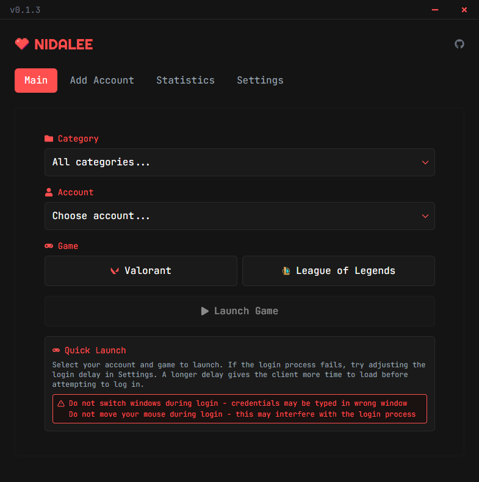

# 💘 NIDALEE

  
  
  
  
  
  

  
  
<i>A modern account manager for League of Legends and Valorant</i>

## 🩷 About

Nidalee is a sleek account manager for League of Legends and Valorant, built with privacy and security in mind. It provides a seamless experience for managing multiple accounts and launching your favorite games.

## 💖 Current Features

💕 **Account Management**
- Secure account storage with encryption
- Easy account switching
- Category organization
- Quick launch for both games

💕 **System Integration**
- Start with Windows
- Minimize to tray
- Auto-minimize on game launch
- Custom login delay settings

💕 **Security**
- Local data storage
- AES-256 encryption
- No cloud storage
- Password protection

💕 **User Interface**
- Modern dark theme
- Clean and intuitive design
- Responsive layout
- Custom titlebar

## 💌 Planned Features

💞 **Enhanced Security**
- Backup and restore
- High Quality Data protection

💞 **Advanced Features**
- Data backup and restore
- Multi-language support

💞 **Quality of Life**
- Custom themes
- Keyboard shortcuts
- Account notes
- Search functionality
- Unban Timer

## 💓 Installation

1. Download the latest release from the [Releases](https://github.com/dancer/Nidalee/releases) page
2. Run the installer (Nidalee.msi)
3. Launch Nidalee from your desktop or start menu

## 💝 Getting Started

1. Launch Nidalee
2. Add your first account in the "Add Account" tab
3. Enter your account details and game type
4. Click "Launch" to start playing!

## 💖 Support

If you like this project, please consider supporting it by giving it a star ⭐ or buying me a coffee!

## 💘 License

This project is licensed under the GPLv3 License - see the [LICENSE](LICENSE) file for details.
